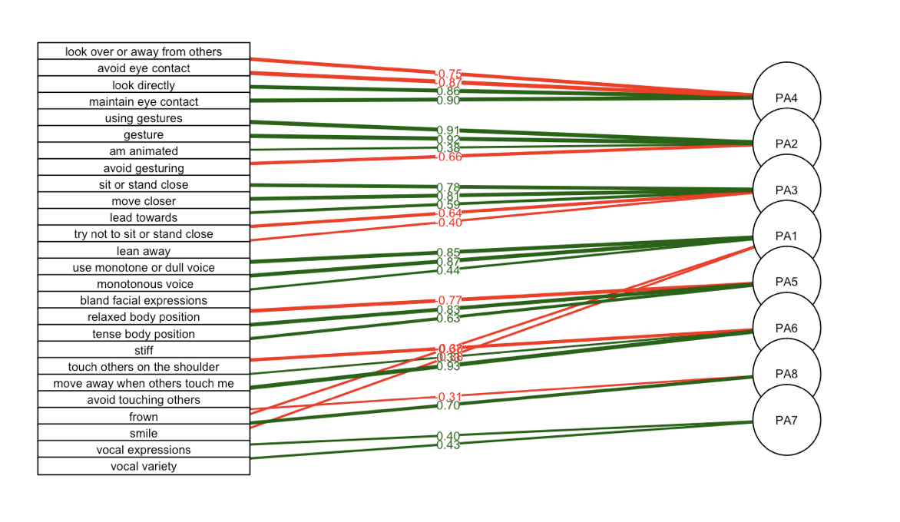

# Habits of Non-verbal Intimacy: reducing number of dimensions using factor analysis

*R | Data tidying | Unsupervised learning | Dimensionality reduction | Factor analysis | Visualization*

# Intro

This project is based on an analysis I did for my honors thesis in neuroscience: analyzing non-verbal behavior in a sample of depressed patients over 6 months of treatment. I had collected data on the frequencies of a number of non-verbal behaviors, and I wished to reduce the number of variables before performing furhter analysis. 

Factor analysis uncovers latent dimensions or "factors" from a large number of related variables. It can be used to reveal insights about which variables group together through positive and negative correlations. 

Since my original dataset contains sensitive patient data, I used here results from the [Nonverbal Immediacy Scale from Open Psychometrics](https://openpsychometrics.org/tests/NIS/).

This data is in the format of survey ratings in which the respondants say how often they perform an action (never, rarely, occasionally, often, very often). This Likert-type data is widely encountered in psychology and market research. In these contexts, factor analysis is a useful tool for translating numerous responses into generalizable constructs and actional inferences (e.g. about a consumer's likelihood to display a certain type of behavior or buy a certain type of product).

# Usage

## To use RStudio:
- Clone this repo and run setup.R to install and attach the required packages
- Individual scripts in `scripts` directory
    - `import_data.R` imports and unzips data from website
    - `clean_data.R` processes the data
    - `perform_FA.R` creates the FA model
    - `interpret_FA.R` explores the behaviors in the factors

- `notebooks/nonverbal_behavior_FA.rmd` run all the code in a notebook (produces .html output)

## To run the Jupyter Notebook in a conda environment:
- Create my R environment from the environment.yml by cloning the repo, stepping into this project directory in the terminal, and running `conda env create -f environment.yml`
- OR Install packages from inside the Jupter Notebook (running the first few cells) 
- `notebooks/nonverbal_behavior_FA.ipynb` run all the code in juypter notebook through the R kernel (which is part of the .yml env file)

# Findings

I found eight latent dimensions using the Principle Axis (PA) factoring method and oblique rotation (which allows the factors to be correlated). I named them conceptually:

    PA Factor 1:  "Flat affect", 
    PA Factor 2:  "Talking with hands", 
    PA Factor 3:  "Close physical proximity", 
    PA Factor 4:  "Strong eye contact", 
    PA Factor 5:  "Stiff body position", 
    PA Factor 6:  "Touch", 
    PA Factor 7:  "Vocal expressiveness", 
    PA Factor 8:  "Positive affect"

## Map of the loadings of each survey response to each PA factor:

# Future 

An exploratory factor analysis can be used to create a model to generate scores for each observation on each new dimension (factor). This is useful for feature extraction and engineer for future data analysis. 

# References

Courtney, Matthew Gordon Ray. (2013). Determining the Number of Factors to Retain in EFA: Using the SPSS R-Menu v2.0 to Make More Judicious Estimations. *Practical Assessment, Research & Evaluation, 18*(8).

Norris, Megan and Luc Lecavelier. (2010). Evaluating the Use of Exploratory Factor Analysis in Developmental Disability Psychological Research. *J Autism Dev Disord, 40,* 8–20. 

Zygmont, Conrad and Mario R. Smith (2014). Robust factor analysis in the presence of normality violations, missing data, and outliers: Empirical questions and possible solutions. *The Quantitative Methods for Psychology, 10*(1), 40-55.

